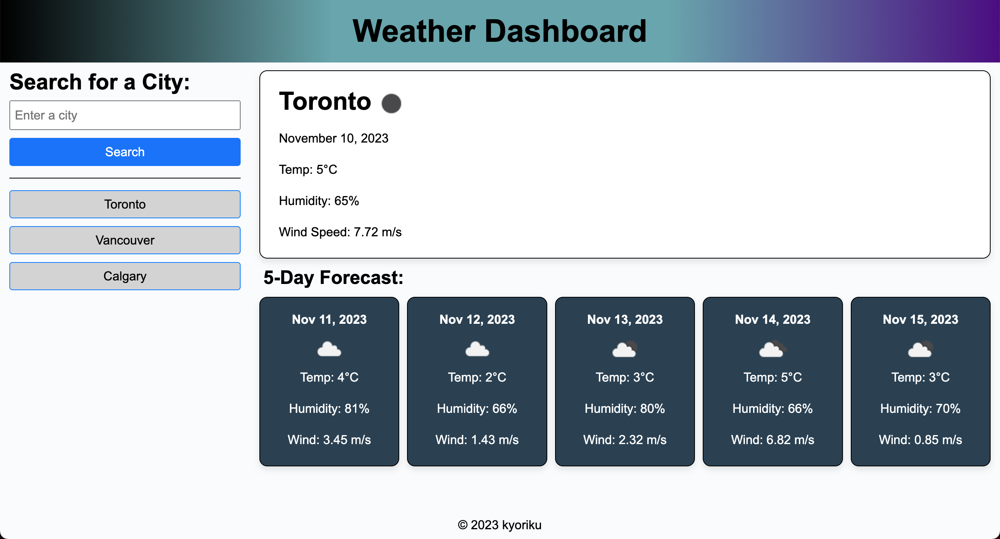

# Weather Dashboard

## Description
This Weather Dashboard is a browser-based application that utilizes third-party APIs, specifically the 5 Day Weather Forecast API from OpenWeatherMap. This dashboard dynamically updates HTML and CSS to provide travelers with accurate and real-time weather information for multiple cities.

As a traveler, the Weather Dashboard addresses the need to efficiently plan trips by offering a comprehensive weather outlook. By integrating the OpenWeatherMap API, the dashboard provides current and future weather conditions for cities, enabling users to make informed decisions about their travel plans, such as what to pack or which activities to schedule.

### Search Functionality:
- Users can easily search for a city using the provided form inputs.
- Upon searching, the dashboard presents users with the current and future weather conditions for the specified city.
- The searched city is then added to the search history for quick reference.

### Current Weather Conditions:
- Users can view the city name, current date, an icon representation of weather conditions, temperature, humidity, and wind speed for the selected city.
- This information helps travelers understand the immediate weather scenario in their chosen destination.

### Future Weather Conditions (5-Day Forecast):
- The dashboard provides a 5-day forecast for the selected city.
- Each day in the forecast displays the date, an icon representing the weather conditions, temperature, humidity, and wind speed.
- This feature assists travelers in planning their itinerary over the course of their stay.

### Search History Navigation:
- Users can click on a city in the search history, and the dashboard will present them again with both current and future weather conditions for that city.
- This allows travelers to easily revisit weather information for previously searched cities without re-entering the city names.

In summary, this Weather Dashboard enhances the travel experience by offering a user-friendly platform for accessing detailed weather information, ensuring that travelers can plan their trips with confidence and be prepared for any weather conditions they may encounter.

## Usage
> [Link to deployed application](https://kyoriku.github.io/weather-dashboard/)

## Credits
- [OpenWeatherMap - Current weather data](https://openweathermap.org/current)
- [OpenWeatherMap - 5 day weather forecast](https://openweathermap.org/forecast5)

## License
Please refer to the LICENSE in the repo.