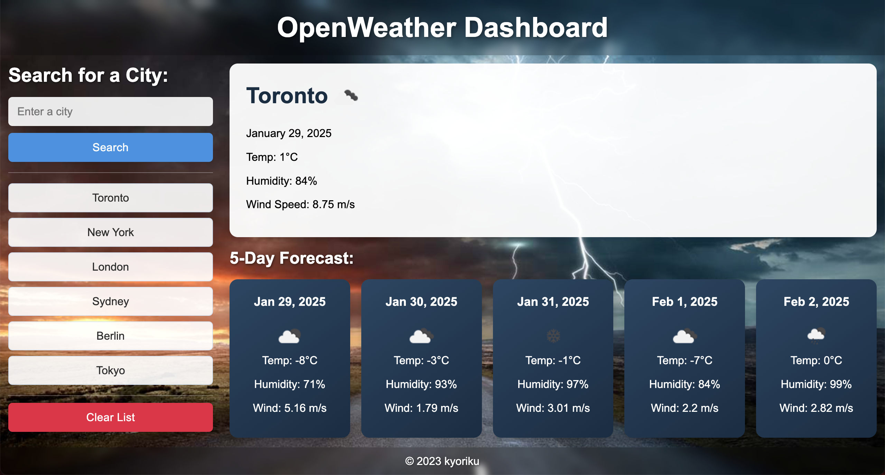

# OpenWeather Dashboard
*An interactive weather forecasting application leveraging the OpenWeatherMap API to provide real-time weather data and 5-day forecasts with search history functionality*

## Built With
[](https://developer.mozilla.org/en-US/docs/Web/HTML)
[](https://developer.mozilla.org/en-US/docs/Web/CSS)
[](https://developer.mozilla.org/en-US/docs/Web/JavaScript)
[](https://openweathermap.org/api)

## Table of Contents
- [Description](#description)
  - [Deployed Site](#deployed-site)
- [Features](#features)
- [Screenshots](#screenshots)
- [Technical Details](#technical-details)
- [Installation](#installation)
- [Usage](#usage)
- [Contributing](#contributing)
- [Credits](#credits)
- [License](#license)
- [Questions](#questions)

## Description
This Weather Dashboard demonstrates the power of API integration in web applications, featuring a dynamic interface that provides real-time weather information and forecasts. Built with vanilla JavaScript and the OpenWeatherMap API, this project showcases practical API implementation while providing an essential tool for travelers and weather enthusiasts.

The application combines current weather data with a 5-day forecast, creating a comprehensive weather outlook that helps users make informed decisions about their travel plans and daily activities. The search history feature enables quick access to previously viewed cities, enhancing the user experience through persistent data storage.

### Deployed Site
Visit the live website at: [https://kyoriku.github.io/openweather-dashboard/](https://kyoriku.github.io/openweather-dashboard/)

## Features
* **Real-Time Weather Data**
  * Current weather conditions for any city
  * Temperature, humidity, and wind speed metrics
  * Visual weather condition indicators
  * Date-stamped information

* **Extended Forecast**
  * 5-day weather prediction
  * Daily temperature ranges
  * Humidity and wind forecasts
  * Weather condition icons for each day

* **Search Management**
  * City search functionality
  * Persistent search history
  * One-click access to previous searches
  * Local storage integration

* **User Interface**
  * Clean, intuitive design
  * Responsive layout
  * Clear data presentation
  * Easy navigation

## Screenshots


## Technical Details
This weather dashboard was built using the following technologies and features:

* **OpenWeatherMap API Integration**: The application leverages two key endpoints from the OpenWeatherMap API:
   * Current Weather API: Fetches real-time weather data including temperature, humidity, wind speed, and weather conditions
   * 5 Day Forecast API: Retrieves future weather predictions in 3-hour intervals, which are processed to show daily forecasts
   * API calls are handled with proper error management and loading states

* **JavaScript Features**: The application utilizes various JavaScript functionalities:
   * `fetch`: Makes asynchronous API calls to OpenWeatherMap endpoints
   * `localStorage`: Manages persistent storage of search history and user preferences
   * `JSON` methods: Handles parsing and stringifying of API responses and stored data
   * Event listeners: Manages user interactions and form submissions

* **DOM Manipulation**: Extensive use of DOM methods for dynamic content updates:
   * `createElement`: Generates new elements for weather cards and search history
   * `querySelector`: Selects and updates specific elements with weather data
   * `innerHTML`: Updates content with weather information and forecasts
   * Class manipulation: Handles styling and visibility states

* **CSS Implementation**: The styling utilizes several CSS features:
   * Flexbox: Creates responsive layouts for weather cards
   * Media queries: Ensures mobile responsiveness
   * Custom variables: Maintains consistent styling through CSS variables
   * Transition effects: Provides smooth animations for user interactions

* **Error Handling**: Comprehensive error management system:
   * API error detection and user feedback
   * Input validation for city searches
   * Fallback displays for missing data
   * Network error handling

* **Data Processing**: Efficient handling of weather data:
   * Temperature conversion functions
   * Date formatting utilities
   * Forecast data aggregation
   * Weather condition mapping for icons

## Installation
To run this project locally:

1. Clone the repository
    ```bash
    git clone https://github.com/kyoriku/openweather-dashboard.git
    ```
2. Open the `index.html` file in your preferred web browser
3. Obtain an API key from [OpenWeatherMap](https://openweathermap.org/api)
4. Add your API key to the configuration

## Usage
1. Enter a city name in the search bar
2. Click the search button or press enter
3. View current weather conditions
4. Scroll down to see the 5-day forecast
5. Click on any city in the search history for quick access

## Contributing
Contributions are welcome! Here are ways you can help:

1. Fork the repository
2. Create a feature branch
    ```bash
    git checkout -b feature/YourFeature
    ```
3. Make your changes - this could include:
    * Improving the UI/UX
    * Adding new weather data displays
    * Enhancing search functionality
    * Optimizing API calls
    * Bug fixes
4. Commit your changes
5. Push to your branch
6. Open a Pull Request

Please ensure your contributions:
* Follow the existing code style
* Include appropriate error handling
* Test all changes locally
* Include clear descriptions in your pull request

## Credits
Built with knowledge from the following resources:

* **OpenWeatherMap**
  * [Current Weather Data API](https://openweathermap.org/current)
  * [5 Day Weather Forecast API](https://openweathermap.org/forecast5)

## License
[](https://opensource.org/licenses/MIT)

This project is licensed under the [MIT](https://opensource.org/licenses/MIT) license - see the LICENSE file for details.

## Questions
For any questions, feel free to email me at devkyoriku@gmail.com.